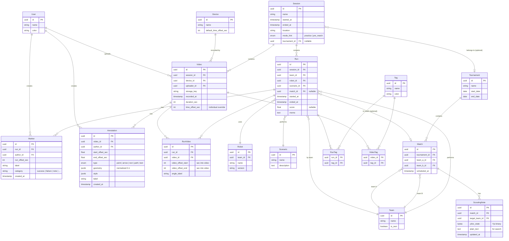

# ロボコン テストラン動画整理アプリ 仕様書

## 1. 概要

ロボコンのテストラン・練習動画を整理し、自チームの振り返りと対戦相手のスカウティングを支援するセルフホスト型 Web アプリ。

- **想定ユーザー**: チームメンバー約20名（自チーム）
- **動作環境**: セルフホスト（チーム内サーバ）、Docker Compose 一発立ち上げ
- **アクセス権限**: 全員同権限（セルフホスト前提のためシンプル化）
- **ストレージ規模**: TB 単位

## 2. 利用モード

同じデータベースを2つの視点で覗く構成。トップ画面のデフォルトビューが切り替わる。

### 練習モード

自チームの動画を時系列で表示。「機体改良の効果検証」「成功率の推移」「個別技術の習熟」が関心事。

### 本番前モード

大会・対戦相手別のグリッドで表示。「対戦相手のスカウティング」「想定戦略の把握」「味方の作戦立案」が関心事。年に3回程度の利用想定。

モードは Session の `mode_hint` で識別し、フィルタとして機能する。

## 3. コア機能

### 3.1 動画の登録とアップロード

- **即時アップロード**: PWA 化したスマホからホーム画面1タップで起動、撮影直後の動画を選んで送信。バックグラウンドで送信され、撮影と並行可能。
- **バッチアップロード**: PC からドラッグ&ドロップで複数ファイル、進捗キュー表示。
- **再開可能アップロード**: tus プロトコル採用。TB 級ファイルでも安心。
- **メタデータ自動抽出**: ffprobe で撮影時刻と長さを取得。
- **オフライン耐性**: Service Worker により練習場の電波が弱くても送信を継続。

撮影時刻の抽出優先順位:

1. `com.apple.quicktime.creationdate`（iPhone、タイムゾーン付きで信頼度高）
2. `creation_time`（多くの mp4 / Android / 一部ビデオカメラ）
3. GoPro の GPMF メタデータ
4. ファイルの mtime（最後の砦、信頼度低）

各 Video には `recorded_at` を保持する。抽出できなかった場合や後から修正された場合は、運用上ユーザーが手で直す前提とする。

### 3.2 Session（撮影セッション）

同じ時間帯に撮影された動画群をまとめる単位。練習日・大会といった「いつの・どこの撮影か」のエントリポイント。

**自動グルーピング**:

- 新動画の時間区間と既存 Session の時間区間（最早動画開始〜最遅動画終了）を比較
- 重なるか、ギャップが閾値（30分）以内なら「Session X に含めますか？」と提案
- 候補が複数なら全提示、該当なしなら「新規 Session を作成」を提案
- 完全自動化はせず、必ず確認ステップを挟む

**時計ズレ補正**:

- `Device` テーブルで機材ごとの時計オフセットを管理
- アップロード時に「このファイルはどのカメラ？」を選択
- Device のデフォルトオフセットを自動適用、個別 Video で上書き可能

### 3.3 Run（試走）とマルチアングル

1試走 = 1 Run。Video（生ファイル）と Run の関係は多対多。

- 1つの長回し動画に複数 Run を含められる（タイムスタンプで区切る）
- 1つの Run に複数アングル動画を紐づけられる（正面・コート横・ドローン等）

**同期再生ビュー**:

- 2〜4分割のグリッドレイアウト
- 撮影時刻ベースの共通マスタータイムライン
- 再生・一時停止・シークが全動画に反映
- 任意のアングルをクリックでメイン大＋他サムネイル表示に切替、再度クリックでグリッドに戻る
- 主アングルはデータには持たず、UI 上の一時状態として扱う

**メタデータ**:

- 機体（Robot、バージョン管理含む）
- 走行課題（Scenario）
- タイム / スコア
- 操縦者・撮影者（User）
- タグ（自由付与）
- メモ

成否は単一の enum で扱わず、Marker（成功・失敗・note などのカテゴリ）と memo、タグの組み合わせで表現する。

### 3.4 Marker（時刻つきコメント）

Run 単位、時刻のみ。「ここで脱輪」「ここでアーム成功」といったイベント記録。

- 保存形式: `run_offset_sec`（Run 開始からの秒数）
- 全アングルで同じマーカーが同時刻に表示
- 検索: 「失敗マーカーだけ通し見」「成功マーカーだけ通し見」が可能
- **リアルタイム同期**: 他の閲覧者にも即座に反映

### 3.5 Annotation（位置指定マークアップ・描き込み）

Video 単位、時刻＋空間情報を持つ。特定アングルに紐づくため Video に直接ぶら下げる。

**永続アノテーションモード（分析用）**:

- 動画を一時停止して描く
- 図形タイプ: 点 / 矢印 / 矩形 / フリーハンド / テキストラベル
- 表示時間範囲を指定して保存
- 後から編集・削除可能

**テレストレーターモード（ミーティング用）**:

- 再生中でも一時停止中でも自由に描ける
- 保存せず、数秒で自動フェード
- 「クリア」ボタンで全消し
- 「保存」ボタンで永続アノテーションに昇格
- ストロークが他参加者にリアルタイム反映（live ink）

**実装方針**:

- 動画上に SVG オーバーレイ
- 座標は必ず正規化（0.0〜1.0）で保存
- フリーハンドは Ramer-Douglas-Peucker で点列を間引いて保存、スムージングは `perfect-freehand`
- 1フレーム送り（`←`/`→`）でフレーム単位の精度

**著者識別**:

- author ごとに色を自動割り当て、ミーティングで「誰の指摘か」が一目で分かる
- 手動上書きも可

### 3.6 ScoutingNote（作戦メモ）

対戦チーム × 試合への作戦メモ。本番前モードの中核。

- リッチテキスト（TipTap / ProseMirror）
- 本文中に「動画 X の 2:34 のマーカー」へのリンクを埋め込み可能
- クリックで動画プレーヤーが該当位置にジャンプ
- **CRDT による共同編集**（Yjs）
- 他人のカーソル位置がリアルタイム表示

### 3.7 マッチアップビュー（本番前モード）

試合単位の画面。左に相手、右に自チームの該当試走動画と作戦メモが並ぶレイアウト。本番直前のミーティングでこれを開く運用を想定。

### 3.8 検索・フィルタ

- 機体・課題・期間・結果での絞り込み
- タグ検索
- メモ・ScoutingNote の全文検索（PostgreSQL pg_trgm）

## 4. データモデル



## 5. アーキテクチャ

```
[Browser]
   │
   ├── tusd ─────────────────────→ MinIO
   │
   ├── Go API (chi + sqlc + pgx)
   │     │
   │     ├── PostgreSQL ←─── river (jobs) ──→ ffmpeg
   │     ├── MinIO (署名URL発行)
   │     └── WebSocket Hub (Marker / Annotation / live ink)
   │
   └── Hocuspocus (y-websocket, Node)
         │
         ├── PostgreSQL (ydoc_state 保存)
         └── Webhook → Go API (plain_text 更新)
```

Docker Compose 構成: `postgres`, `minio`, `tusd`, `app`（Go バイナリ＋静的ファイル）, `hocuspocus` の 5 コンテナ。

## 6. 技術スタック

### バックエンド

- **言語**: Go
- **Web フレームワーク**: chi（軽量、標準ライブラリ志向）
- **DB アクセス**: sqlc + pgx
- **マイグレーション**: golang-migrate もしくは goose
- **ジョブキュー**: river（Postgres ベース、Redis 不要）
- **WebSocket**: coder/websocket
- **動画処理**: 当面は `os/exec` で ffmpeg を呼び出し

### アップロード

- **プロトコル**: tus
- **サーバ**: tusd（Go 製リファレンス実装）
- MinIO への直接アップロードに対応、API サーバを経由しない

### フロントエンド

- **構成**: Vite + React SPA + Mantine UI、Go バイナリが静的配信も担う
- **状態管理**: Zustand（シンプルなグローバル状態管理） + TanStack Query（サーバ状態のキャッシュと更新）
- **フォーム**: TanStack Form（バリデーションと状態管理）
- **リッチエディタ**: TipTap（ProseMirror ベース）
- **共同編集**: Yjs + y-prosemirror
- **フリーハンド**: perfect-freehand
- **動画オーバーレイ**: SVG（自前実装）

### 同期サーバ

- **CRDT**: Hocuspocus（Node、Yjs 共同編集用）
- 認証フック、Postgres 永続化、Webhook を公式サポート

### データストア

- **DB**: PostgreSQL（pg_trgm で全文検索）
- **動画ストレージ**: MinIO（S3 互換、セルフホスト）

### 認証

- アプリ内アカウント発行（チーム20人 / セルフホスト / 全員同権限）

## 7. リアルタイム同期の設計

リアルタイム要件は性質の異なる 2 種類があり、別レイヤーで実装する。

### 7.1 Marker / Annotation の同期（WebSocket pub/sub）

DB を真実の源（source of truth）とし、WebSocket は通知用。

**チャンネル設計**:

- `run:{run_id}` — Run の Marker 変更通知
- `video:{video_id}` — Video の Annotation 変更通知
- `session:{session_id}` — Session 全体の更新

**メッセージフロー**:

1. クライアント A が POST /api/markers
2. Go API が Postgres に INSERT
3. Go API が `hub.Broadcast("run:" + run_id, {type: "marker.created", marker})`
4. 購読中のクライアント B, C, D に配信
5. 各クライアントがローカル状態を更新

再接続時は REST で最新状態を取得するだけで整合性回復。複雑なリプレイ機構は不要。

### 7.2 テレストレーター live ink

永続化しない一時的な描画ストロークを WebSocket で配信。

- 点列を `{type: "ink.point", video_id, stroke_id, x, y, t}` で 30〜60fps に絞って配信
- Postgres を経由せず WebSocket ハブを素通し（fire and forget）
- `stroke.end` で確定、`canvas.clear` で全消し
- 「保存」操作で永続 Annotation として REST に投げる

### 7.3 ScoutingNote の共同編集（CRDT）

Yjs + TipTap + Hocuspocus の組み合わせ。

**永続化と検索の二段構え**:

- Yjs 状態は `scouting_notes.ydoc_state BYTEA` に Hocuspocus が定期保存
- 派生プレーンテキストを `scouting_notes.plain_text TEXT` に保存、全文検索インデックスを張る
- Hocuspocus の `onChange` フック（debounce）で Go API に webhook、Go 側で `plain_text` を更新

**マーカーリンク**:

- TipTap のカスタムノード `{type: "marker_link", marker_id}`
- レンダリング時に Postgres から Marker を引いて「📍 2:34 脱輪」と表示
- クリックで動画プレーヤーが該当位置にジャンプ

## 8. フェーズ計画

### Phase 1: 土台＋マルチアングル（6〜8 週間目安）

- 動画アップロード（tus、PWA 即時、PC バッチ）
- メタデータ自動抽出と Session 自動グルーピング
- Device 管理と時計ズレ補正
- Run のメタデータ管理（Robot, Scenario, 結果, タグ）
- マルチアングル同期再生
- Marker 機能 + WebSocket リアルタイム反映
- 検索・フィルタ
- サムネイル自動生成
- Robot / Scenario / Tag マスタ管理
- DB スキーマには Team / Tournament / Match / ScoutingNote / Annotation まで含めて切っておく（UI は後）

### Phase 2: 本番前モード＋アノテーション

- 対戦相手 Team の登録 UI
- Tournament / Match の作成
- マッチアップビュー
- Annotation（永続 + テレストレーター）の実装と WebSocket リアルタイム反映
- Hocuspocus 導入、ScoutingNote 共同編集
- TipTap のマーカー埋め込みカスタムノード
- アノテーション付き静止画の PNG エクスポート
- 「明日の ○○ 戦」共有ページ

### Phase 3: 運用が回り始めてから

- HLS 変換とジョブキュー本格運用
- 比較ビュー（改良前後の Run を並べる）
- ダッシュボード（成功率推移、タイム推移）
- プレゼンス機能（誰がどこを見ているか、同期視聴）
- 追従アノテーション（キーフレーム補間）
- アノテーション焼き込み済み動画の書き出し
- 音声波形による精密同期

## 9. 残された検討事項

- Tournament の階層構造（地区予選・全国大会・トーナメント内のラウンド）をどこまでモデル化するか
- バックアップ / リストア手順（TB 級ストレージ前提）
- 代替わり時のオンボーディング資料
- モバイル側の動画録画品質・容量の取り扱い指針
